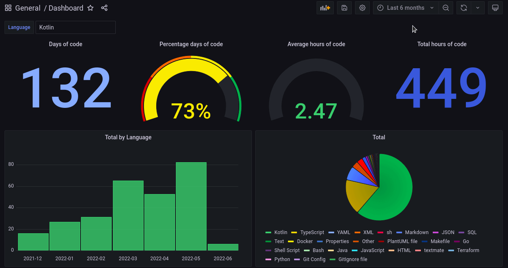
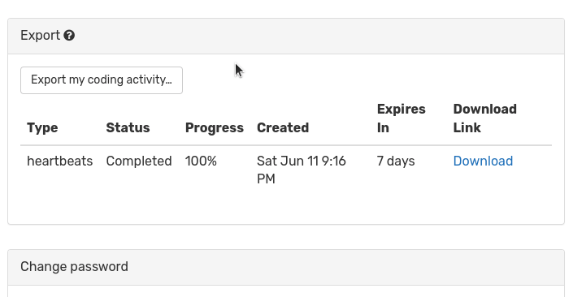

# WakaTime Grafana Dashboard

This project allows you to visualize your hours programming on a dashboard in Grafana

<p align="center">
  
</p>

## How to run this project

1. Run:
```sudo chown 472:472 ./grafana_data && sudo chmod -R 777 grafana_data```
2. Run ```docker-compose up -d```
3. Export `Daily totals` in WakaTime settings then download JSON file

<p align="center">
  
</p>

4. Send a request `POST` to `http://localhost:8080/` with JSON content

To see dashboard go to http://localhost:3001/d/Nle8uvjnk/dashboard?orgId=1

⚠️ Wakatime has a limit of data it can store for the free versions.⚠️

I recommend that you export data each 6 months and make a backup of the JSON files or the database